# GitHub 2019 数字年报

## 背景

2018 是“开源”的幸运数字，在这一年，“开源软件”从诞生开始，走过了整整 20 周年。随着开源软件的日趋风靡，开源已经成为一项世界性的流行运动，它是人类在互联网发展进程中探索出的一种面向全球的大规模协作生产方式，它以开放共享、合作共赢为宗旨，有效地推进了全球化进程。开源经过形成时期、古典时代、移动时代到云开源时代的不断发展，开源产业链条已经逐渐形成[5]。越来越多的中国IT企业，无论是大厂还是小厂，都越来越积极的投入人力物力，参与开源，贡献开源。开源代码代表着IT技术发展最先进的方向，开源社区代表着开放的协作精神与创新的摇篮[2]。

2018 年的时候，全球最大的代码托管平台 GitHub 已有 3000 万开发人员，囊括 200 万家企业或组织，拥有 9600 万个代码库，已提交 2 亿的 pull request。而在 GitHub 发布的 2019 年年度报告中[1]，开发人员则已经超过 4000 万，有将近 300 万个组织帐户，新创建的 repo 数超过了 4400 万个。目前的 GitHub，有超过 80％ 的开发者来自美国以外的地区，其中中国的贡献者数目仅次于美国，排名第二，中国的开发者 fork 并 clone 的项目比往年增加了48％。

近期陆续所发布的「中国开源年度报告」[2]和「中国开源项目 Grank 分析报告（2019）」[3]，则从另外一个方面说明了开源在中国受关注的程度。这些报告要么是通过问卷调查的形式进行的数据采集，要么是通过 GitHub API 定向采集的局部数据进行的分析，并且报告中所利用的指标也较为单一[3][4]，难以准确的体现开源世界的全貌。国内最大的公有代码托管平台「码云」近期也推出了该平台的「 2019 年度数据报告」[6]，同样也存在上述问题，但很多地方还是值得参考的。我们认为，一份有价值的报告必定是基于全域大数据的基础上，结合专家进行关键数据的人工标注，通过构建合理的分析模型，才能得出一套相对完整的，可以反复进行推演的数据报告（报告、数据、算法均需开源）。

为此，X-lab 开放实验室在这些报告的基础上，试图进一步更加全面的对 GitHub 上开发者的行为数据进行分析，尽量客观准确的展现目前开源世界所发生的事请，特别是中国的开发者和企业组织在整个开源产业中的表现和趋势，并正式发布这份「GitHub 2019 数字年报」。本报告采用 GitHub 全域事件日志进行统计分析（2019 年共计 5.46 亿条），并对分析出的前 1500 个项目进行人工标注，挑选出中国的个人开发者和企业组织，同时构建了科学合理的数学模型进行分析。更重要的是，本报告所包括内容、数据、算法采取开源的方式，一是方便大家进行复现本报告中的相关结论，更重要的是在此基础之上的不断优化，甚至二次创新。相信这样一种方式的数字报告能够给大家带来最大的价值。

参考文献：

[1]. GitHub 官方 2019 年度报, [https://octoverse.github.com/](https://octoverse.github.com/)

[2]. 中国开源年度报告, [https://kaiyuanshe.cn/project/china-open-source-report/](https://kaiyuanshe.cn/project/china-open-source-report/)

[3]. 中国开源项目 Grank 分析报告（2019）, [https://linux.cn/article-11755-1.html](https://linux.cn/article-11755-1.html)

[4]. 徐川, 覃云, 中国互联网公司开源项目调研报告, [https://www.infoq.cn/article/G4O6JUhJF*Tsv9eWM0L6](https://www.infoq.cn/article/G4O6JUhJF*Tsv9eWM0L6)

[5]. 云计算开源产业联盟, 开源产业白皮书（2019）, 2019 云计算开源产业大会, 北京.

[6]. Gitee 2019 年度数据报告, [https://blog.gitee.com/2020/01/08/gitee-2019-annual/](https://blog.gitee.com/2020/01/08/gitee-2019-annual/)

## 数据集及方法

### 数据集

本报告采用 GitHub 全域事件日志进行统计分析，日志采集范围为 UTC 时间 2019-01-01T00:00:00Z 至 2020-01-01T00:00:00Z 共计约 5.46 亿条。关于 GitHub 事件日志相关说明，请参考 [GitHub 官方文档](https://developer.github.com/v3/activity/events/)。

### 方法

本报告中所有数据均基于 GitHub 事件日志统计，统计模型包含如下几个关键定义：

#### 开发者活跃度

开发者活跃度，其定义为某特定 GitHub 账号在一段时间内在某特定 GitHub 项目中的活跃评价指标。其活跃度由该账号在该项目中的行为数据决定，本报告中所关心的行为包含如下几种：

* Issue comment：在 issue 中参与讨论是最基本的行为，每个评论计入 1 次。
* Open issue：在项目中发起一个 issue，无论是讨论、Bug 报告或提问，对项目都是带来活跃的，每个发起的 issue 计入 1 次。
* Open pull request：为项目提交一个 PR，表示已对该项目进行源码贡献，则每次发起一个 PR 计入 1 次。
* Pull reuqest review comment：对项目中的 PR 进行 review 和讨论，需要对项目有相当的了解，并且对项目源码的质量有极大帮助，每个评论计入 1 次。
* Pull request merged：若有 PR 被项目合入，即便是很小的改动，也需要对项目有较为深入的理解，是帮助项目进步的真切贡献，则每有一个 PR 被合入计入 1 次。

以上 5 个种行为在该报告模型中，具有不一样的权重，其加权值逐级增加，加权值分别为 1、2、3、4、5，即：

#### 项目活跃度

项目活跃度，其定义为某特定项目在一段时间内的活跃评价指标。其活跃度由该段时间内在本项目中产生活跃的开发者活跃度加权计算得到，即：

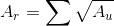

使用开方的加权方式，用于抹平因核心开发者活跃度过高而导致项目活跃度过高，在该计算方式下，活跃度计算方式对参与人数较多而活跃情况平均的项目更加友好。

## 宏观统计结果

本次使用 2019 年全年 GitHub 日志进行统计，总日志条数约 5.46 亿条，相较 2018 年的 4.21 亿条增长约 29.7%。在上述开发者活跃度与项目活跃度的定义下，统计得到 2019 年总活跃项目数量约 512W 个，相较 2018 年的约 313W 增长约 63.6%，2019 年总活跃开发者数量约 360W，相较 2018 年的约 303W 增长约 18.8%。

对于这 512W 个项目的活跃度分布，如下图：

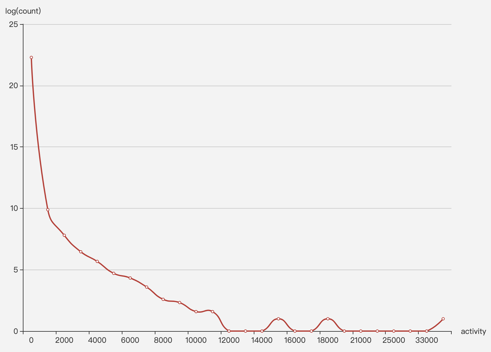

对于这 512W 个项目的活跃开发者人数分布，如下图：

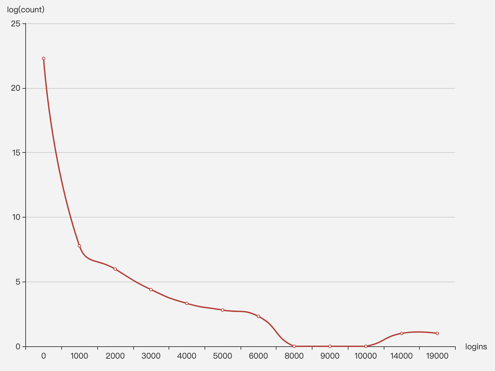

上述两张图中，我们使用了对数坐标，事实上在所有仓库中，仅有 1399 个项目的活跃度超过了 1000，占总项目数量不足万分之三；而参与开发者数量超过 1000 人的项目仅有 333 个，可谓万里挑一。说明大多数项目还是处于低活跃少参与的状态。

## 世界 Top 10 开发者账号

根据上述给出的活跃度定义，我们对 2019 年全年活跃开发者进行了活跃度统计与排名，这里给出世界活跃度 Top 10 开发者账号列表：

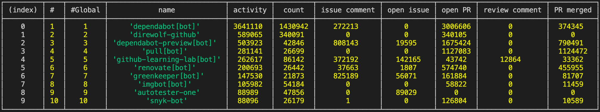

从上述列表可以看到，世界活跃度 Top 10 开发者账号均为机器人账号，其中 7 个账号为 GitHub App，从这张列表中也可以看到开发者最常使用的自动化仓库管理、协作功能有哪些，主要集中在依赖更新、自动同步上游、学习、漏洞检测等。

另外，除活跃度外，还可以以活跃仓库数量进行排名，此类榜单中 Top 10 也均为机器人，从该表中也可以看到机器人的受欢迎程序。世界服务仓库最多的 Top 10 开发者账号列表如下：

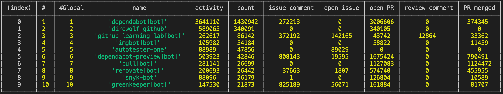

世界活跃度与贡献项目数量 Top 1000 开发者列表请查询[这里](./DataSheets.xlsx)，所有开发者详情可由程序脚本获取。

## 世界 Top 10 项目

根据上述给出的项目活跃度定义，我们对 2019 年全年活跃项目进行了活跃度统计与排名，这里给出世界活跃度 Top 10 项目的列表：

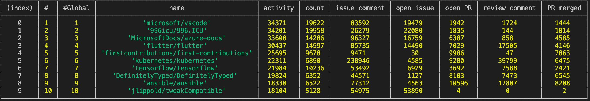

世界活跃度与参与开发者数量 Top 1000 项目列表请查询[这里](./DataSheets.xlsx)，所有项目详情可由程序脚本获取。

## 中国 Top 20 项目分析

我们对所有排名的项目，筛选出了中国 Top 20 的项目，列表如下：

[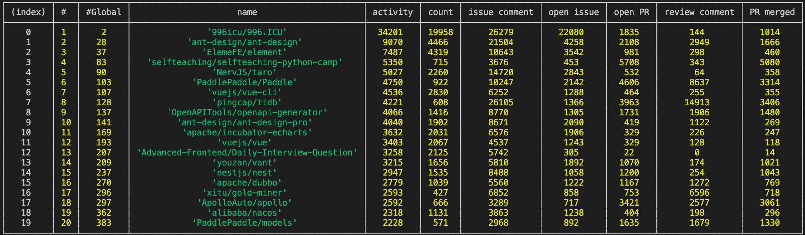

所有中国项目详情列表请查询[这里](https://github.com/X-lab2017/github-analysis-report-2019/blob/master/DataSheets.xlsx)，如若发现错误或遗漏，欢迎提交 Issue 或 PR 到 GitHub。

从Top 20列表信息中，我们可以看出，“996icu/996·ICU”的综合活跃度数值远远高于其他项目，数值上超过其他项目一个数量级。该项目中数值最高的指标为open issue，同样超出其他项目一个数量级，达到了22080，最低的指标为review comment，只有144。996.icu 作为一个现象级开源项目，指发生于2019年3月-4月的 GitHub 事件，中国程序员为抗议 996 工作制，发布了 996.icu 项目，短时间内获得超过20万颗星星，成为太阳系最受欢迎的项目。

列表中两个比较有趣的项目是“selfteaching/selfteaching-python-camp”和“Advanced-Frontend/Daily-Interview-Question”，这两个项目的活跃排名分别是第四和第十一，分别对应了教育和面试求职两个领域。这侧面反映出大众对这两个领域的需求和关注度。

另一个非常注目的项目是"pingcap/tidb"，该项目的review comment是20个项目中最高的，issue comment仅次于“996icu/996·ICU”，open PR 仅次于 “selfteaching/selfteaching-python-camp”。

**repo协作关系图**

针对上文分析方法得出的排名前20的中国开源项目，本文对仓库的历史commits记录进行挖掘。Git仓库中的每一个commit记录由贡献者产生，对仓库的一个或者多个文件产生影响，因此对特定时段内的所有贡献者的提交记录分析能反映出了贡献值的活跃程度、贡献者的协作模式以及项目本身的类型属性。本文通过Pydriller、git2net等工具对中国活跃程度排名前20的项目commit记录进行挖掘分析，并做可视化展示，相关数据文件参考[这里]()。

从时间维度上，本文将重点放在2019中仓库的提交记录，对于每一个仓库，以单月和全年为粒度分析单个仓库的commit记录，并将仓库的内容贡献模式以二部图的方式可视化展示。数据文件的可视化图中蓝色节点代表仓库文件，红色节点代表用户，节点越大，表面该账号对应的用户修改的文件内容越多，节点间的边的粗细反应了贡献次数。

我们通过几个典型的例子来对分析结果进行说明展示。从可视化的关系图来看，996.icu项目从3月份开始出现提交记录，且3、4两个月份最为活跃，之后热度开始消减。该项目的网络图结构呈现出“二元”形态，即图中存在一个主要贡献者（n_996Icu，另一个相对较大的用户节点ImgbotApp为机器人账户）, 网络中大多数文件内容由该账户贡献，同时存在一个被频繁修改的文件（README.md），多数贡献账户只对该文件做出内容贡献。其中n_996Icu对README.md之间的贡献最频繁，这一点从两者之间的链接权重可以看出，这个模式在该项目的3月份贡献图可以被很清晰的观察到。

从tidb项目的内容贡献图来看，整个社区存在多个核心维护者，他们各自维护着不同的模块，周边也有大量的开发者在做出贡献。从单月的数据来看，该社区每个月的提交修改非常频繁，相较于其他项目来看，tidb以比较快的速度进行演化更新。与之相对比来看，其他项目的单月贡献活跃程度及贡献者多样性远不及tidb项目。以vuejs下的两个项目（vue-cli 和 vue）为例，在vuejs/vue-cli项目中，从每月贡献图可以看出该项目的大部分贡献由（Haoqun Jiang）做出，单月的主要贡献者不超过两名。vuejs/vue大部分贡献都是由一个账号（Evan You 尤雨溪）做出的，该项目4月份之后内容贡献图呈现出许多协作孤岛的形态，反映出贡献者对少量文件的修改，项目变动不大。

**996.ICU项目3月份贡献图**

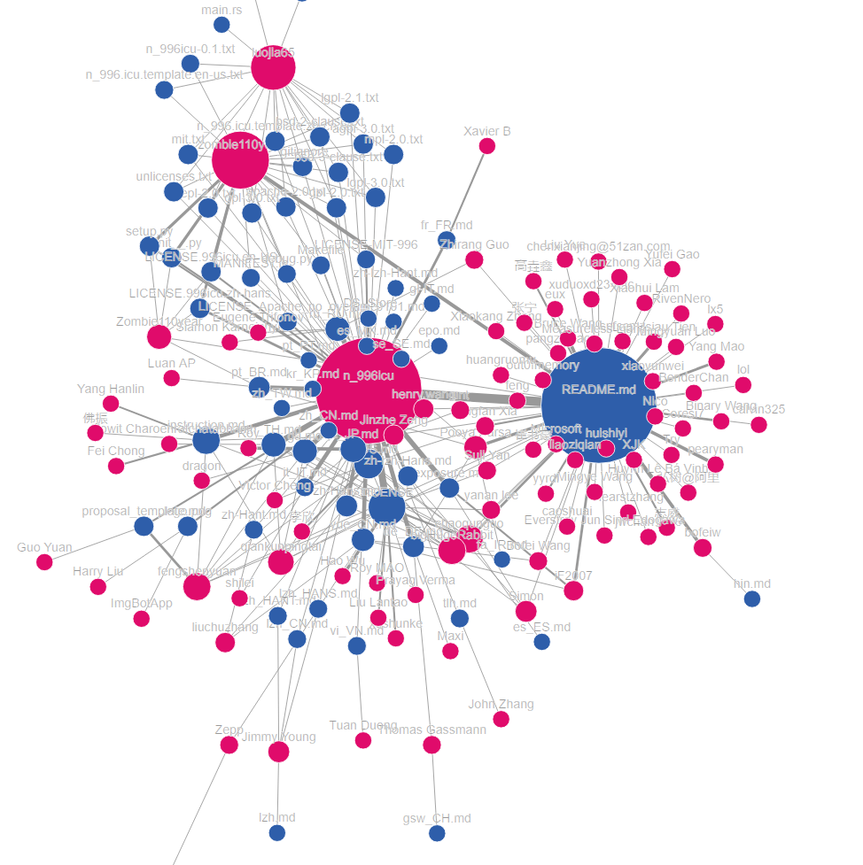

**996 .ICU全年贡献图**

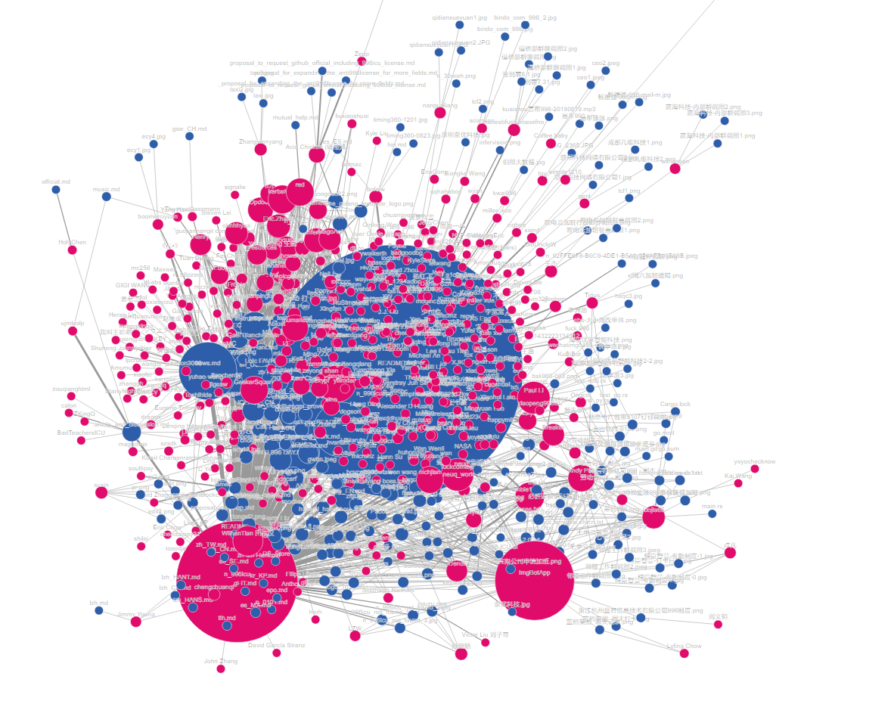

**tidb 10月内容共享图**

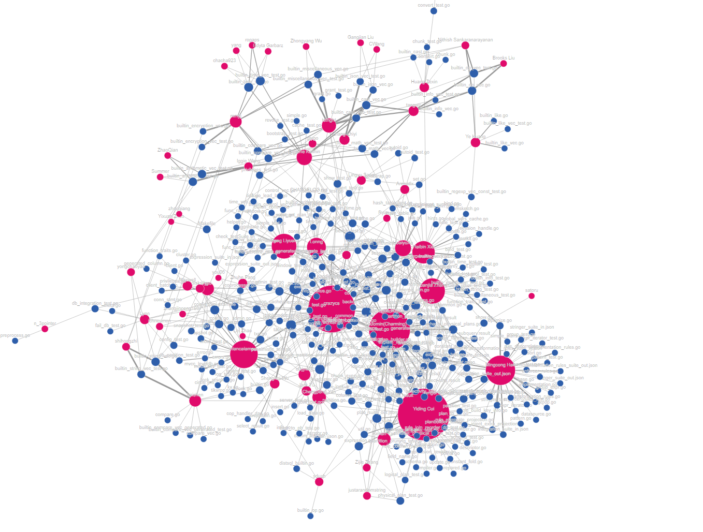

**tidb 2019全年贡献图**

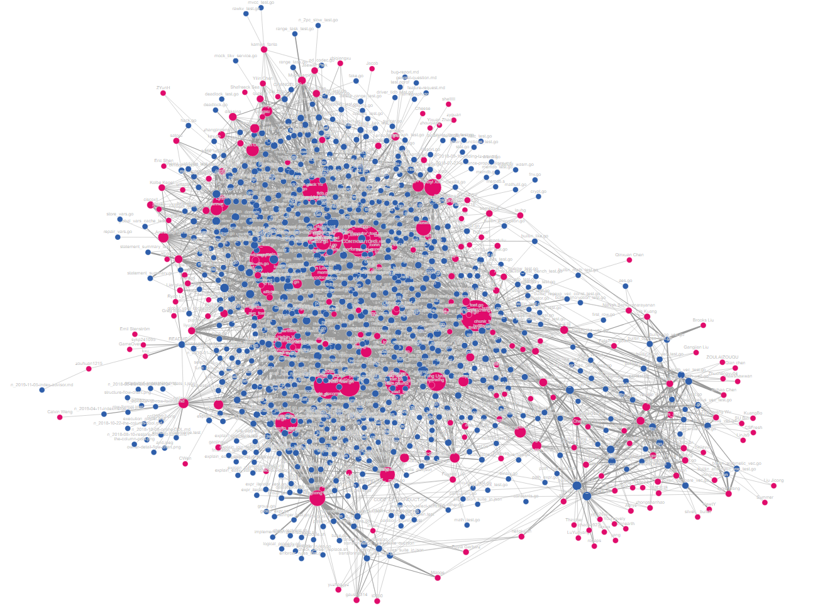

**vue 3月内容贡献图**

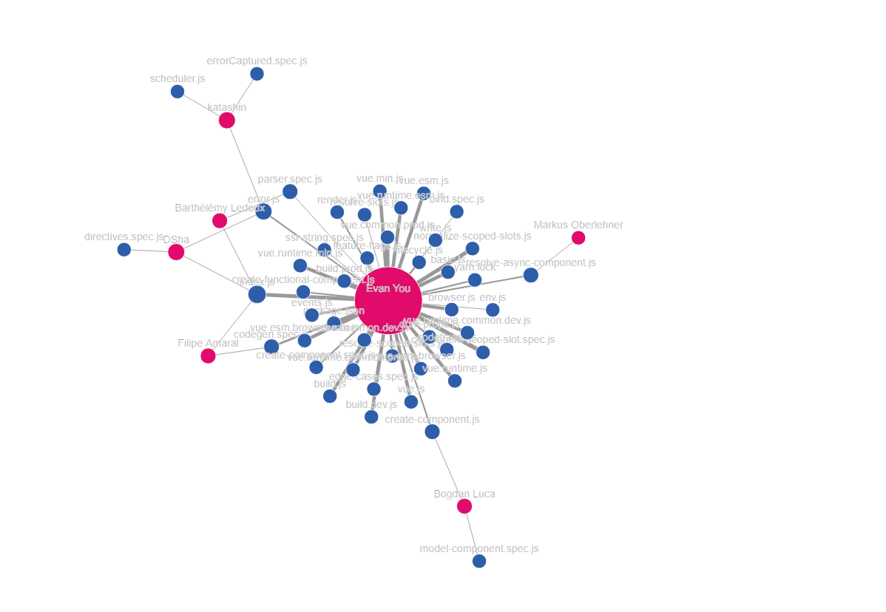

**vue 4月内容贡献图**

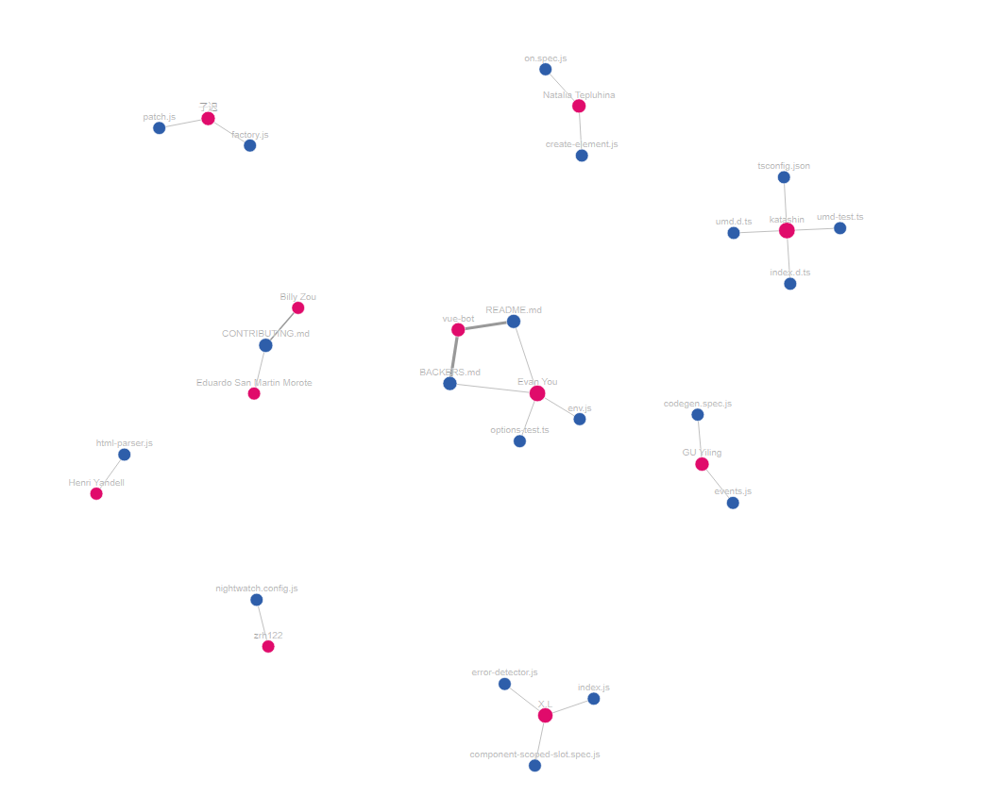

由此可以看出不同类型的项目，他们的社区协作网络也呈现出完全不同的形态。更多顶级项目在 2019 年每月的协作网络图请查询[这里](https://github.com/X-lab2017/github-analysis-report-2019/blob/master)。

**相关工具和文献**

[PyDriller](https://pydriller.readthedocs.io/en/latest/)  : [D. Spadini, M. Aniche, and A. Bacchelli, PyDriller: Python Framework
for Mining Software Repositories, 2018.](https://www.sback.it/publications/fse2018td.pdf) 

[PathPy](https://www.pathpy.net/) Ingo Scholtes, “Software Package pathpy,”, 2017, [Online].

Git2net: [C. Gote, I. Scholtes, and F. Schweitzer, git2net - Mining Time-Stamped Co-Editing Networks from Large git Repositories, 2019 ](https://arxiv.org/pdf/1903.10180.pdf) 

## 中国 Top 20 项目 Top Contributor 采访

对于中国 Top 20 的项目，我们分析了其每个项目中最活跃的开发者，并就其中的一些开发者进行了采访，为什么他们的项目可以如此活跃，社区管理和运营的技巧是什么？

### **吴晟**

2019年，中国开源得到长足的进步，活跃度，参与人数和参与公司都大幅度的增加。总体来说有以下两个特点。

第一，大厂领军。多个由中国公司发起的开源项目，特别是进入Apache、Linux、CNCF等基金会项目，得到国内外的广泛运用。社区多元化能力得到长足的进步。

第二，个人创建的项目依靠个人领袖力，社区发展，也能成为优秀的项目。虽然依然数量稀少，但成功者非常突出，甚至超过绝大多数的公司开源项目。

需要补充一点的，开始有一批以开源为核心的创建公司涌现出来，给开源注入了不少活力和全球化的元素。

但是同时，不足也还十分明显，目前主流且广泛使用的开源项目，90%都来自于单个商业厂商，但是鲜有跨公司的合作共建。让中国起步的开源项目，在全球范围寻求更大范围的成功时，缺少助力。

同时，第一梯队和其他开源团队差距正在进一步拉大，顶级开源项目已经开始全面着眼国际市场，而绝大多数的开源项目，甚至对社区起步和项目的选择依然迷茫。

最后，学生作为开源项目的增长潜力，对开源的认知，参与热情，参与能力，远远低于工业界的要求和预期，以及国外水平。

### **黄东旭**

对于数据库产品来说，要想有社区，先需要有用户，用户越多，自然而然社区就越大。早期我们的精力选在放在互联网公司，互联网公司采用新技术的周期短，而且技术交流也更频繁；另外最重要的是互联网公司是业务驱动的，受商业的影响比较小，比较适合初创公司或者新产品切入，而且在互联网行业站稳脚跟，会给社区带来一个信号，这个产品是以技术取胜的，另一方面，互联网的公司的工程师也会成为社区的种子用户。第二个阶段是社区的治理，我们有一套很完整的社区运营规则，完全透明面向社区，每一个 Contributor的晋升都有一条清晰的路线图，当个社区的朋友能够更好的参与。总体来说，用户，社区是相辅相成的。

另外，我认为TiDB社区的成功，早期有几个决定很关键：

1、选择 MySQL 协议兼容，认准 MySQL 社区在扩展性问题上的痛点针对性的解决，解决存在且普遍的问题。
2、架构上高度分层，保持架构的清晰，让社区能够低门槛的参与。
3、永远倾听一线用户的声音，接地气说人话，保持文档的齐全（包括中英文）。
4、站在巨人的肩膀上，积极借力各种社区，例如 Etcd、RocksDB、Go 语言和 Rust 语言社区等。

## 技术公司开源项目一览

各大开源项目，基本都有科技公司的支持，我们给出了一个科技公司维护的 GitHub 组织和项目列表，并根据该列表，计算了公司所维护的开源项目在 2019 年的活跃情况与开发者参与情况，结果如图：

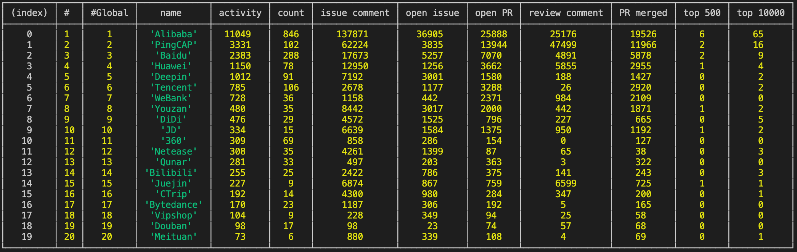

如若发现数据错误或遗漏，欢迎提交 Issue 或 PR 到 GitHub。

## 展望

GitHub 2019 数据年报作为 X-lab 的首次 GitHub 数据年报，主要为大家提供了一些统计数据，并简单对社区协作关系做了一些分析工作。未来，X-lab 实验室将投入大量在校学生在 GitHub 数据挖掘的层面，旨在基于真实数据挖掘数据背后的价值，例如协作网络、社区管理、项目变迁等等，也希望可以在不久的将来，向社会提供这些数据分析的能力。

## 附录

X-lab 将随本报告同时开源本次报告的原始数据与分析程序。

### 原始数据

由于原始的日志文本数据数据量较大（约 1.45TB），故随本次报告的开源数据为统计后数据，data.json.gz 文件为压缩后的数据文件，总大小约为 225MB，解压后文件内容为文本内容，总大小约 1.3GB，总行数约 2169 万行。每行为一个记录项，由 JSON 格式编码，内容说明如下：

| 字段 | 类型   | 说明     |
|:----|:-------|:--------|
| r   | string | 项目名称 |
| u   | string | 账号名称 |
| t   | number | 操作类型 |
| c   | number | 操作次数 |

其中操作类型的说明如下：

| 数值 | 含义           |
|:----|:---------------|
| 0   | Issue comment  |
| 1   | Opne issue     |
| 2   | Open PR        |
| 3   | Reivew comment |
| 4   | PR merged      |

该文件不再区分具体日期，直接给出每个账号在每个项目中的全年操作次数，以方便处理。

由于原始数据体积较大，为方便使用，原始数据将通过 CDN 独立分发，地址为：[http://cdn.opensource-service.cn/github-analysis-report-2019/data.json.gz](http://cdn.opensource-service.cn/github-analysis-report-2019/data.json.gz)。

### 分析程序

分析程序随报告一同开源，地址为 [https://github.com/X-lab2017/github-analysis-report-2019](https://github.com/X-lab2017/github-analysis-report-2019)，具体使用方法请参考项目说明。
