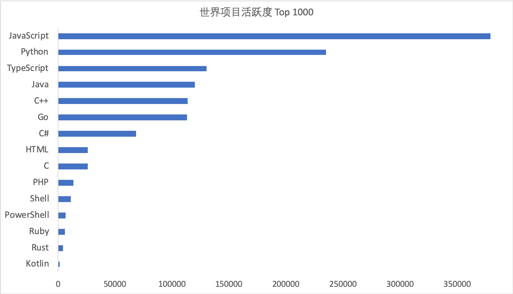
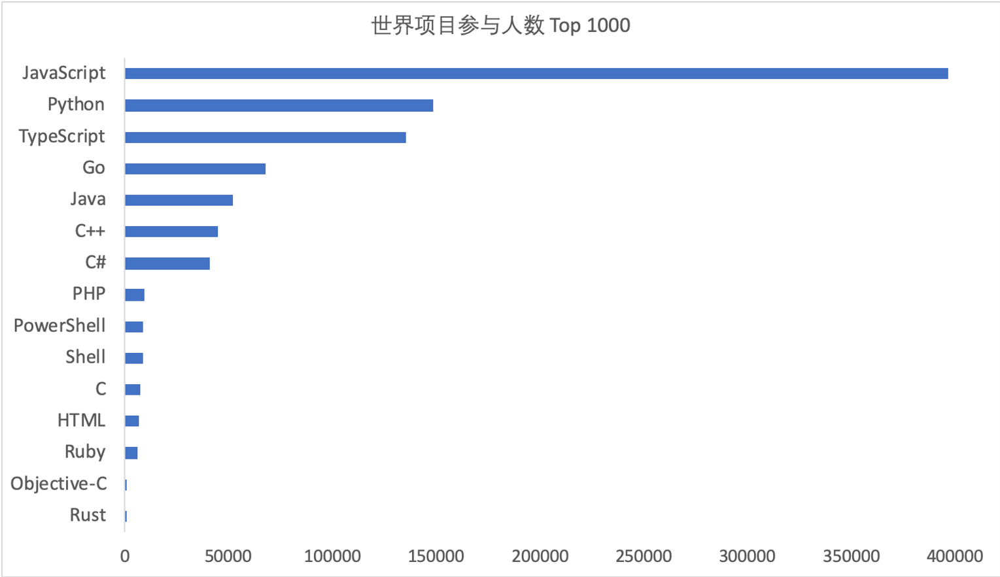
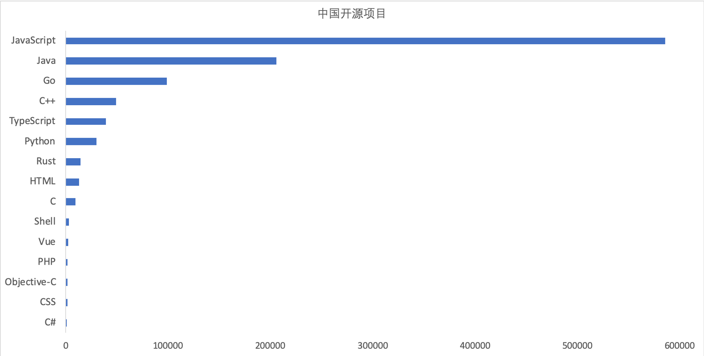

# GitHub 2019 数字年报

**摘要** :在开源日益重要的今天，我们需要一份建立在全域大数据基础上的相对完整、可以反复进行推演的数据报告（报告、数据、算法均需开源）。本项目为X-lab 开放实验室团队发起，旨在通过分析Github全网的开发者行为日志，通过数据的视角，来观察全球范围内的开源现状、进展趋势、演化特征、以及未来挑战等问题，除了展现目前开源世界全貌之外，我们特别关注中国的开发者和企业组织在整个开源产业中的表现。本报告中使用 2019 年全年 GitHub 日志进行统计，总日志条数约 5.46 亿条。

**关键词**：开源、行为数据、开发者行为、Github、数字报告

## 1、背景

2018 是“开源”的幸运数字，在这一年，“开源软件”从诞生开始，走过了整整 20 周年。随着开源软件的日趋风靡，开源已经成为一项世界性的流行运动，它是人类在互联网发展进程中探索出的一种面向全球的大规模协作生产方式，它以开放共享、合作共赢为宗旨，有效地推进了全球化进程。开源经过形成时期、古典时代、移动时代到云开源时代的不断发展，开源产业链条已经逐渐形成[1]。越来越多的中国IT企业，无论是大厂还是小厂，都越来越积极的投入人力物力，参与开源，贡献开源。开源代码代表着IT技术发展最先进的方向，开源社区代表着开放的协作精神与创新的摇篮。

2018 年的时候，全球最大的代码托管平台 GitHub 已有 3000 万开发人员，囊括 200 万家企业或组织，拥有 9600 万个代码库，已提交 2 亿的 pull request。而在 GitHub 发布的 2019 年年度报告中[2]，开发人员则已经超过 4000 万，有将近 300 万个组织帐户，新创建的 repo 数超过了 4400 万个。目前的 GitHub，有超过 80％ 的开发者来自美国以外的地区，其中中国的贡献者数目仅次于美国，排名第二，中国的开发者 fork 并 clone 的项目比往年增加了48％。

近期陆续所发布的「中国开源年度报告」[3]和「中国开源项目 Grank 分析报告（2019）」[4]，则从另外一个方面说明了开源在中国受关注的程度。这些报告要么是通过问卷调查的形式进行的数据采集，要么是通过 GitHub API 定向采集的局部数据进行的分析，并且报告中所利用的指标也较为单一，难以准确的体现开源世界的全貌[4] [5]。国内最大的公有代码托管平台「码云」近期也推出了该平台的「 2019 年度数据报告」[6]，同样也存在上述问题，但很多地方还是值得参考的。我们认为，一份有价值的报告必定是基于全域大数据的基础上，结合专家进行关键数据的人工标注，通过构建合理的分析模型，才能得出一套相对完整的，可以反复进行推演的数据报告（报告、数据、算法均需开源）。

为此，X-lab 开放实验室团队在这些报告的基础上，试图进一步更加全面的对 GitHub 上开发者的行为数据进行分析，尽量客观准确的展现目前开源世界所发生的事请，特别是中国的开发者和企业组织在整个开源产业中的表现和趋势，并正式发布这份「GitHub 2019 数字年报」。本报告采用 GitHub 全域事件日志进行统计分析（2019 年共计 5.46 亿条），并对分析出的前 1500 个项目进行人工标注，挑选出中国的个人开发者和企业组织，同时构建了科学合理的数学模型进行分析。更重要的是，本报告所包括内容、数据、算法采取开源的方式，一是方便大家进行复现本报告中的相关结论，更重要的是在此基础之上的不断优化，甚至二次创新。相信这样一种方式的数字报告能够给大家带来最大的价值。

## 2、总体宏观统计结果

本次使用 2019 年全年 GitHub 日志进行统计，总日志条数约 5.46 亿条，相较 2018 年的 4.21 亿条增长约 29.7%。在上述开发者活跃度与项目活跃度的定义下，统计得到 2019 年总活跃项目数量约 512W 个，相较 2018 年的约 313W 增长约 63.6%，2019 年总活跃开发者数量约 360W，相较 2018 年的约 303W 增长约 18.8%。

### 2.1 整体状态分析

对于这 512W 个项目的活跃度分布，如图1所示；这 512W 个项目的活跃开发者人数分布，如图2所示。对开发者活跃度与项目活跃度的定义参见附录部分的详细说明。

 
  图1： 整体项目活跃度分布

 
  图2： 活跃开发者人数分布

上述两张图中，我们使用了对数坐标，事实上在所有仓库中，仅有 1399 个项目的活跃度超过了 1000，**占总项目数量不足万分之三**；而参与开发者数量超过 1000 人的项目仅有 333 个，**可谓万里挑一。**   

**这一数据结果说明大多数项目还是处于低活跃、少参与的状态。**

###  2.2 世界 Top 10 开发者账号

根据上述给出的活跃度定义，我们对 2019 年全年活跃开发者进行了活跃度统计与排名，这里给出世界活跃度 Top 10 开发者账号列表：

从数据统计来看，世界活跃度 Top 10 的开发者账号均为机器人账号，其中 7 个账号为 GitHub App。这也可以看出开发者最常使用的自动化仓库管理、协作功能有哪些，主要集中在依赖更新、自动同步上游、GitHub 学习、漏洞检测等方面。

世界活跃度与贡献项目数量 Top 1000 开发者列表请查询[这里](https://github.com/X-lab2017/github-analysis-report-2019/blob/master/DataSheets.xlsx)，所有开发者详情可由程序脚本获取。

### 2.3 世界 Top 10 项目

根据上述给出的项目活跃度定义，我们对 2019 年全年活跃项目进行了活跃度统计与排名，这里给出世界活跃度 Top 10 项目的列表：

其中`996.ICU` 作为一个现象级开源项目，大家并不陌生。2019 年 3 月 到 4 月，中国程序员为抗议 996 工作制，在GitHub发布了一个名为 996.ICU 的项目，该项目短时间内获得超过 20 万颗星星，成为最耀眼的明星项目。

而活跃度最高的项目则是来自微软的跨平台代码编辑器`Microsoft/vscode`；此外微软使用开源的方式来建设其 Azure 云平台的项目`MicrosoftDocs/azure-docs`排名第三，显然微软在开源上的努力获得了程序员的认可。

在这个TOP10排名中，涉及了三个来自谷歌的项目，分别是：前端跨平台开发框架`Flutter`、容器编排系统`Kubernetes`以及深度学习框架`TensorFlow`，这也进一步说明谷歌在开源上的努力和影响力获得业内的认可。

### 2.4 中国 Top 20 项目分析

我们对所有排名的项目，筛选出了中国 Top 20 的项目，列表如下：

所有中国项目详情列表请查询[这里](https://github.com/X-lab2017/github-analysis-report-2019/blob/master/DataSheets.xlsx)，如若发现错误或遗漏，欢迎提交 Issue 或 PR 到 GitHub。

从Top 20列表信息中，我们可以看出，`996icu/996.ICU`的综合活跃度数值远远高于其他项目，数值上超过其他项目一个数量级。该项目中数值最高的指标为`open issue`，同样超出其他项目一个数量级，达到了 22080，最低的指标为`review comment`，只有 144。

列表中两个比较有趣的项目是 `selfteaching/selfteaching-python-camp `和 `Advanced-Frontend/Daily-Interview-Question`，这两个项目的活跃排名分别是第4 和第 13，分别对应了教育和面试求职两个领域。这侧面反映出大众对这两个领域的需求和关注度非常高。

另一个非常注目的项目是 `pingcap/tidb`，该项目的` review comment `是 20 个项目中最高的，达到惊人的 14913，相对比之下，该项属性下排名第二的 `PaddlePaddle/Paddle` 只有它的不到 60%，而 `issue comment `仅次于 `996icu/996.ICU`，`open PR `仅次于` selfteaching/selfteaching-python-camp `与` PaddlePaddle/Paddle`，分别排名对应属性的第二与第三位。而其 608 的开发者参与数量，与其他前端项目相较甚远，但却有着如此高的活跃度，也可以看出其社区的硬核程度，之后我们会对该项目做进一步的分析。

从这个列表中我们还发现，在中国开源成绩比较突出的两家公司是百度和阿里。百度的深度学习平台`PaddlePaddle`占据了两个项目，分别是核心框架`Paddle`和模型库`Models`；此外开放自动驾驶平台`Apollo`也榜上有名。另外，由百度贡献的数据可视化项目`ECharts`在2018年进入`Apache`孵化器，此次榜单中`ECharts`排名11。

咱们再来看看阿里，阿里“服务于企业级产品设计体系” 的`Ant-Design`，是蚂蚁金服采用 React 封装的一套组件库，在中国范围内属最活跃的开源项目，排名第二。上榜的基于Java的RPC框架`Dubbo`，也在今年成为Apache 顶级项目。另外上榜的阿里项目还包含动态服务发现`Nacos`。

在中国的Top 20列表中，我们发现前端项目几乎占据了一半，包括阿里的`Ant-Design`组件库，由饿了么（已被阿里收购）前端团队开源的 Vue UI 组件库Element，由有赞基于Vue构建的移动UI组件库`Vant`等等。这说明在国内，前端群体在社区更为活跃；另外前端代码一般也不太涉密，因此公司在心态上更开放一些。不过这其中也有一点需要引起注意，上榜的前端项目组件库居多，但是缺少核心项目。

### 2.5 repo协作关系图

针对上文分析方法得出的排名前 20 的中国开源项目，本文对仓库的历史 commits 记录进行挖掘。Git 仓库中的每一个 commit 记录由贡献者产生，对仓库的一个或者多个文件产生影响，因此对特定时段内的所有贡献者的提交记录分析能反映出了贡献者的活跃程度、协作模式以及项目社区本身的类型属性。我们通过仓库挖掘的工具对中国活跃程度排名前 20 的项目 commit 记录进行挖掘分析，并做可视化展示，相关数据文件参考[这里](https://github.com/X-lab2017/github-analysis-report-2019/tree/master/network)。所采用的分析工具可以参考文献[7~9]。

从时间维度上，我们将重点放在 2019 中仓库的提交记录，对于每一个仓库，以单月和全年为粒度分析单个仓库的 commit 记录，并将仓库的内容贡献模式以二部图的方式可视化展示。数据文件的可视化图中蓝色节点代表仓库文件，红色节点代表用户，节点越大，表面该账号对应的用户修改的文件内容越多，节点间的边的粗细反应了贡献次数。

我们通过几个典型的例子来对分析结果进行说明展示。从可视化的关系图来看，`996.ICU`项目从 3 月份开始出现提交记录，且 3、4 两个月份最为活跃，之后热度开始消减。该项目的网络图结构呈现出“二元”形态，如图3所示，即图中存在一个主要贡献者（`n_996Icu`，另一个相对较大的用户节点 `ImgbotApp` 为机器人账户）, 网络中大多数文件内容由该账户贡献，同时存在一个被频繁修改的文件 `README.md`，多数贡献账户只对该文件做出内容贡献。其中 `n_996Icu `对 `README.md` 之间的贡献最频繁，这一点从两者之间的链接权重可以看出，这个模式在该项目的3月份贡献图可以被很清晰的观察到。图4展示了该项目全年的状态，同样能够观察到上述特点。

<figure class="half" align="center">    
   
  <figcaption align='center'> 图3: 996.ICU项目3月份贡献图</figcaption>
   
  <figcaption align='center'> 图4: 996 .ICU全年贡献图</figcaption>
</figure>   

从` tidb `项目的内容贡献图来看（图5），整个社区存在多个核心维护者，他们各自维护着不同的模块，周边也有大量的开发者在做出贡献。从单月的数据来看（图6），该社区每个月的提交修改非常频繁，相较于其他项目来看，`tidb` 以比较快的速度进行演化更新。与之相对比来看，其他项目的单月贡献活跃程度及贡献者多样性远不及 `tidb` 项目。以 `vuejs `下的两个项目（`vue-cli` 和` vue`）为例，在 `vuejs/vue-cli` 项目中，从每月贡献图可以看出该项目的大部分贡献由（`Haoqun Jiang`）做出，单月的主要贡献者不超过两名（图7和图8）。`vuejs/vue` 大部分贡献都是由一个账号（`Evan You 尤雨溪`）做出的，该项目 4 月份之后内容贡献图呈现出许多协作孤岛的形态，反映出贡献者对少量文件的修改，项目变动不大。

<figure class="half" align="center">    
    
  <figcaption align='center'> 图5: tidb 2019全年贡献图	</figcaption>
  
  <figcaption align='center'> 图6: tidb 10月内容共享图</figcaption>
</figure>

<figure class="half" align="center">    
    
  <figcaption align='center'> 图7:vue 3月全年贡献图	</figcaption>
  
  <figcaption align='center'> 图8: vue 4月贡献图	</figcaption>
</figure>

由此可以看出不同类型的项目，他们的社区协作网络也呈现出完全不同的形态。更多顶级项目在 2019 年每月的协作网络图请查询[这里]()。

### 2.6 开发语言分析

我们分别对世界项目活跃度 Top 1000 的项目、世界项目参与人数 Top 1000 的项目和中国开源项目统计了不同开发语言的项目数量以及使用不同开发语言进行 PushEvent 操作的开发者的数量，二者相乘估计使用不同开发语言的开发者的数量。（如图9和图10所示），可以发现 JavaScript 使用最多。

 
  图9： 世界项目活跃度 Top 1000 项目开发语言统计

 
  图10: 世界项目参与人数Top 1000项目开发语言统计

原因我们分析如下：

* JavaScript 是一门直接被嵌入到 HTML 中的脚本语言，是一门可以被 Web 浏览器理解的语言。它无需编译、在浏览器环境可以直接运行的特性，让 JavaScript 项目在活跃度的提升上占据了优势。

* 谷歌开发的 Angular 和 Facebook 开发的 React，另外还有 Vue，这些主流前端框架都是 JavaScript 生态圈中的一部分。

* 这几年随着行业的发展，JavaScript 变得几乎”无所不能“，现在基本所有的主流互联网应用，其前端都有大量的 JavaScript 代码。比如我们日常使用的邮件、社交工具等等。

此外，全球项目活跃度 Top1000 和全球项目参与人数 Top 1000 的项目中，Python的使用居于第二位，分析可能的原因为：

* Python 相较于其他主流编程语言具有更好的可读性，简单易学、易于维护。

* Python 应用范围广，它自带的各种模块加上丰富的第三方模块，免去了很多“重复造轮子”的工作，可以更快地实现多种功能。

* 人工智能的浪潮进一步推动了 Python 的发展，很多人工智能任务以及大数据分析都会优先使用 Python 实现。

在中国开发者社区中，我们发现除了JavaScript外，Java和Go的活跃度也很高，分别排在第二、第三，如图11所示。

 
  图11：中国开源项目开发语言统计

我们认为：在服务器和移动端开发上，Java 还没有真正意义上的对手，可以预见Java 依旧是企业软件、大数据、电商...最核心的技术栈。Go 是谷歌开发的新一代编程语言，在过去的几年里取得了很大的成功。现代的云端、网络和 DevOps 软件的很大一部分都是用 Go 编写的，例如 Docker、Kubernetes、Terraform、etcd、Istio 等项目。许多公司也将它用于通用场景下的开发工作，Go语言中国社区也极具活力。

对比全球的开发语言排行榜，我们发现中国开源项目中Python的使用与Java、Go、C++相比较少。另外还值得关注的是，Ruby和PowerShell在中国社区受重视的程度还不够。

### 2.7  技术公司开源项目一览

其实各大开源项目的背后，基本都有科技公司的支持，我们给出了一个科技公司维护的 GitHub 组织和项目列表，并根据该列表，计算出了科技公司所维护的开源项目在 2019 年的活跃情况与开发者参与情况，结果如下表所示：

在国内企业的开源数据中，我们可以看到阿里的数据几乎在所有类别里都名列第一，有时甚至是其它公司之和，并且在社区化 / 开放等方面也做得不错。但放到全球角度，出自阿里的知名度相对较高的项目，还是Apache Dubbo，以及在2019年收购而来的大数据流处理框架Flink。2019年9月在杭州的云栖大会上，阿里宣布贾扬清正式担任阿里巴巴开源技术委员会负责人，开源将明确升级为阿里技术战略之一。

AI 是百度开源最鲜明的竞争力，比如PaddlePaddle和自动驾驶平台 Apollo。PaddlePaddle也是当前国内唯一开源开放的深度学习平台。

华为在2019年也做了不少开源的工作，推出了原生数据库 GaussDB 以及鸿蒙OS等，一改保守作风。

而腾讯2019年也对外宣布”已在 Github 上开源了86 个项目，超过 1000 个贡献者参与了开源贡献，拥有超过 25 万个 Star 数，腾讯在 Github 全球公司贡献榜上排名前十“。

可以看出，各大企业近年来均在不断加大开源社区生态建设。

## 3、中国顶级开源项目访谈录

我们对中国部分顶级的开源项目负责人进行了采访，他们对当前的中国开源怎么看？以及为什么他们的项目可以如此活跃，社区管理和运营的技巧是什么？

**谭中意**

​		百度开源社区负责人, PaddlePaddle/Paddle

很高兴看到 PaddlePaddle 在中国活跃项目排行榜上活跃度比较高。这里简单介绍下 PaddlePaddle 团队的社区管理经验， 因为是开源项目，所以坚持开放透明非常重要，研发过程也需要开放透明。

所以 Paddle 的日常研发，全部都是在 GitHub 上进行，不会存在内部版本（即某些公司的开源项目在公司内部研发，定期放出去一个版本）。

而且对于开发运营过程中开发者反馈的各个问题，也都是引导他们来 GitHub 提 Issue，这样有记录，也有沉淀，而不是在微信群里/QQ 群里回答问题，导致问题不容易被记录，并被后面的工程师作为参考。

开放透明的研发过程，对于取信于开源社区非常重要。

**吴晟**

​		apache/skywalking

2019年，中国开源得到长足的进步，活跃度，参与人数和参与公司都大幅度的增加。总体来说有以下两个特点。

第一，大厂领军。多个由中国公司发起的开源项目，特别是进入Apache、Linux、CNCF等基金会项目，得到国内外的广泛运用。社区多元化能力得到长足的进步。

第二，个人创建的项目依靠个人领袖力，社区发展，也能成为优秀的项目。虽然依然数量稀少，但成功者非常突出，甚至超过绝大多数的公司开源项目。

需要补充一点的，开始有一批以开源为核心的创建公司涌现出来，给开源注入了不少活力和全球化的元素。

但是同时，不足也还十分明显，目前主流且广泛使用的开源项目，90%都来自于单个商业厂商，但是鲜有跨公司的合作共建。让中国起步的开源项目，在全球范围寻求更大范围的成功时，缺少助力。

同时，第一梯队和其他开源团队差距正在进一步拉大，顶级开源项目已经开始全面着眼国际市场，而绝大多数的开源项目，甚至对社区起步和项目的选择依然迷茫。

最后，学生作为开源项目的增长潜力，对开源的认知，参与热情，参与能力，远远低于工业界的要求和预期，以及国外水平。

**黄东旭**

​		PingCAP CTO, pingcap/tidb, tikv/tikv

对于数据库产品来说，要想有社区，先需要有用户，用户越多，自然而然社区就越大。早期我们的精力放在互联网公司，互联网公司采用新技术的周期短，而且技术交流也更频繁；另外最重要的是互联网公司是业务驱动的，受商业的影响比较小，比较适合初创公司或者新产品切入，而且在互联网行业站稳脚跟，会给社区带来一个信号，这个产品是以技术取胜的，另一方面，互联网的公司的工程师也会成为社区的种子用户。第二个阶段是社区的治理，我们有一套很完整的社区运营规则，完全透明面向社区，每一个 Contributor 的晋升都有一条清晰的路线图，当个社区的朋友能够更好的参与。总体来说，用户，社区是相辅相成的。

另外，我认为 TiDB 社区的成功，早期有几个决定很关键：

*  选择 MySQL 协议兼容，认准 MySQL 社区在扩展性问题上的痛点针对性的解决，解决存在且普遍的问题。

* 架构上高度分层，保持架构的清晰，让社区能够低门槛的参与。

* 永远倾听一线用户的声音，接地气说人话，保持文档的齐全（包括中英文）。

* 站在巨人的肩膀上，积极借力各种社区，例如 Etcd、RocksDB、Go 语言和 Rust 语言社区等。

##  4、展望

GitHub 2019 数据年报作为 X-lab 的首次 GitHub 数据年报，主要为大家提供了一些统计数据，并简单对社区协作关系做了一些分析工作。未来，X-lab 实验室将投入大量在校学生在 GitHub 数据挖掘的层面，旨在基于真实数据挖掘数据背后的价值，例如协作网络、社区管理、项目变迁等等，也希望可以在不久的将来，向社会提供这些数据分析的能力。

如若发现数据错误或遗漏，欢迎提交 Issue 或 PR 到 GitHub。

项目地址：https://github.com/X-lab2017/github-analysis-report-2019

## 致谢

X-lab开放实验室是一群由来自华东师范大学、同济大学的师生所构成的开放创新共同体，专业背景包括计算机科学、数据科学及其相关跨学科，长期思考并实践教育与开源两大主题。本次数字年报的主要贡献者包括：赵生宇、王伟、周添一、范家宽、王皓月、夏小雅、杨尚辉等，我们欢迎更多的开源爱好人士加入我们，共同推动开源在世界的发展。

## 参考文献

[1]. 云计算开源产业联盟, 开源产业白皮书（2019）, 2019 云计算开源产业大会, 北京.

[2]. GitHub 官方 2019 年度报, https://octoverse.github.com/

[3]. 中国开源年度报告, https://kaiyuanshe.cn/project/china-open-source-report/

[4]. 中国开源项目 Grank 分析报告（2019）, https://linux.cn/article-11755-1.html

[5]. 徐川, 覃云, 中国互联网公司开源项目调研报告, https://www.infoq.cn/article/G4O6JUhJF*Tsv9eWM0L6

[6]. Gitee 2019 年度数据报告, https://blog.gitee.com/2020/01/08/gitee-2019-annual/

[7]. PyDriller : D. Spadini, M. Aniche, and A. Bacchelli, PyDriller: Python Framework for Mining Software Repositories, 2018.

[8]. PathPy Ingo Scholtes, “Software Package pathpy,”, 2017, [Online].

[9]. Git2net: C. Gote, I. Scholtes, and F. Schweitzer, git2net - Mining Time-Stamped Co-Editing Networks from Large git Repositories, 2019

## 附录：数据集及方法

**数据集**

本报告采用 GitHub 全域事件日志进行统计分析，日志采集范围为 UTC 时间 2019-01-01T00:00:00Z 至 2020-01-01T00:00:00Z 共计约 5.46 亿条。关于 GitHub 事件日志相关说明，请参考[ GitHub 官方文档](https://developer.github.com/v3/activity/events/)。

**分析方法**

本报告中所有数据均基于 GitHub 事件日志统计，统计模型包含如下几个关键定义：

**（1）开发者活跃度**

开发者活跃度，其定义为某特定 GitHub 账号在一段时间内在某特定 GitHub 项目中的活跃评价指标。其活跃度由该账号在该项目中的行为数据决定，本报告中所关心的行

为包含如下几种：

* Issue comment：在 issue 中参与讨论是最基本的行为，每个评论计入 1 次。

* Open issue：在项目中发起一个 issue，无论是讨论、Bug 报告或提问，对项目都是带来活跃的，每个发起的 issue 计入 1 次。

* Open pull request：为项目提交一个 PR，表示已对该项目进行源码贡献，则每次发起一个 PR 计入 1 次。

* Pull reuqest review comment：对项目中的 PR 进行 review 和讨论，需要对项目有相当的了解，并且对项目源码的质量有极大帮助，每个评论计入 1 次。

* Pull request merged：若有 PR 被项目合入，即便是很小的改动，也需要对项目有较为深入的理解，是帮助项目进步的真切贡献，则每有一个 PR 被合入计入 1 次。

以上 5 个种行为在该报告模型中，具有不一样的权重，其加权值逐级增加，加权值分别为 1、2、3、4、5，即：

**（2）项目活跃度**

项目活跃度，其定义为某特定项目在一段时间内的活跃评价指标。其活跃度由该段时间内在本项目中产生活跃的开发者活跃度加权计算得到，即：

使用开方的加权方式，用于抹平因核心开发者活跃度过高而导致项目活跃度过高，在该计算方式下，活跃度计算方式对参与人数较多而活跃情况平均的项目更加友好。
